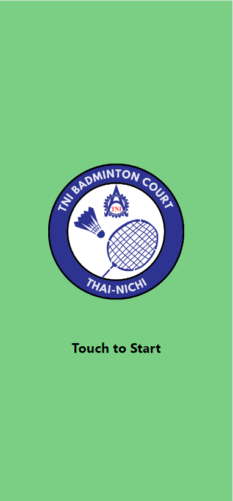
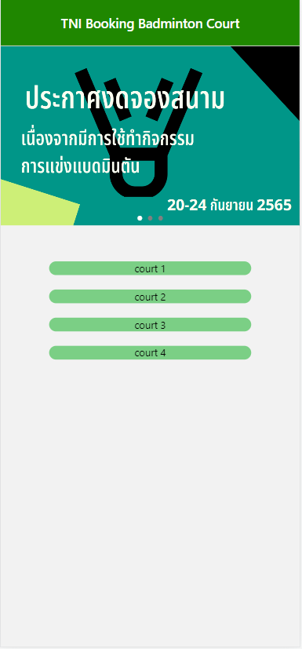
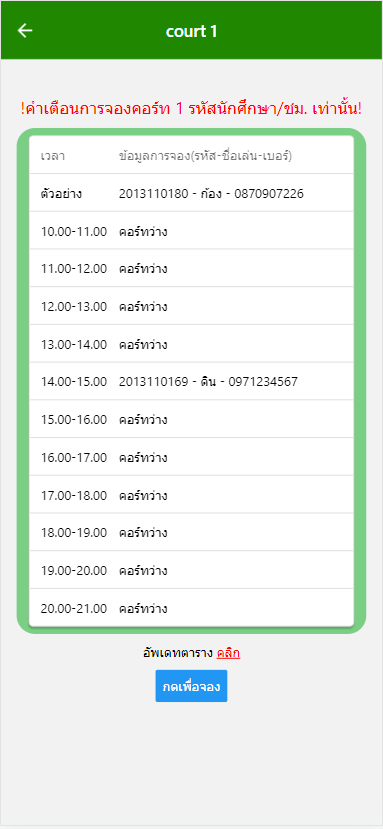

<!-- PROJECT LOGO -->

  <h3 align="center">TNI Booking Badminton Court Application</h3>
  

<!-- ABOUT THE PROJECT -->
## About The Project
แอพพลิเคชั่นนี้เป็นส่วนหนึ่งของรายวิชา ITE-439 Mobile Device Application Development

แอพพลิเคชั่นนี้เป็นแอพพลิเคชั่นี่สร้างขึ้นเพื่อใช้จองสนามแบดของมหาวิทยาลัย

<a href="https://github.com/LittleT0fu/ReactNativeFinalProject/blob/main/Documents/%E0%B9%81%E0%B8%9A%E0%B8%9A%E0%B8%99%E0%B8%B3%E0%B9%80%E0%B8%AA%E0%B8%99%E0%B8%AD%E0%B9%82%E0%B8%84%E0%B8%A3%E0%B8%87%E0%B8%81%E0%B8%B2%E0%B8%A3%20(Project%20Proposal).pdf" ><strong>Proposal »</strong> </a>

<a href="https://github.com/LittleT0fu/ReactNativeFinalProject/blob/main/Documents/TNI%20Booking%20Badminton%20Court%20Manual.pdf" ><strong>Manual »</strong> </a>

<a href="https://www.youtube.com/watch?v=_dP0scLv5h0" ><strong>Demonstration »</strong> </a>

  

(<a href="#readme-top">back to top</a>)

### Built With

We use React to build this Application

* [![React][React.js]][React-url]

(<a href="#readme-top">back to top</a>)

<!-- About Team -->
## About Team

<strong>Group No. 4</strong>

2013110131 นายชลสิทธิ์มณีกอบกุลวงศ์

2013110180 นายกฤษกรเดชาเลิศ

2013110263 นายปรัชญาอรุณรัตน์

2013110529 นายไกรวิชณ์ชินชนะถาวร

<!-- MARKDOWN LINKS & IMAGES -->
<!-- https://www.markdownguide.org/basic-syntax/#reference-style-links -->

[React.js]: https://img.shields.io/badge/React-20232A?style=for-the-badge&logo=react&logoColor=61DAFB
[React-url]: https://reactjs.org/
